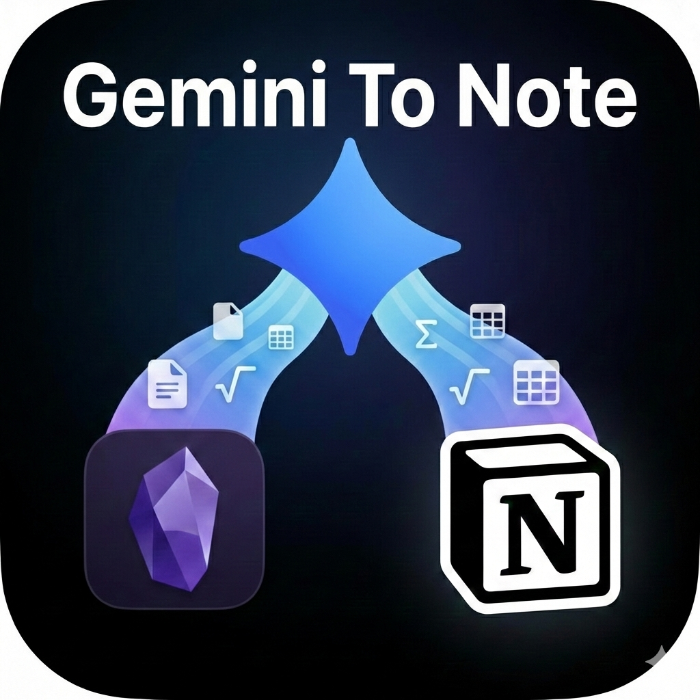
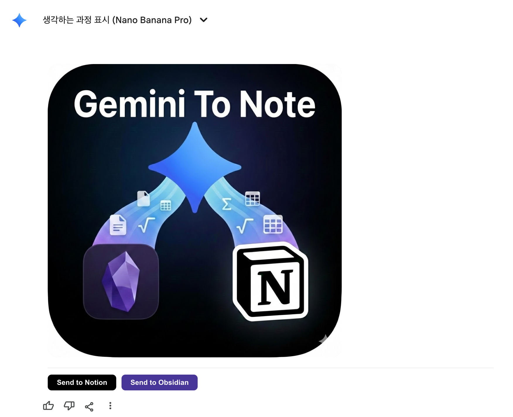

#  Gemini to Note (Notion & Obsidian Integrated)

A Tampermonkey userscript that allows you to easily send Gemini (Google AI) responses directly to Notion or Obsidian with full support for tables, math formulas (LaTeX), and Markdown formatting.

## Features

- **One-Click Export**: Adds "Send to Notion" and "Send to Obsidian" buttons directly under Gemini responses.
- **Rich Formatting**: Perfectly preserves tables, bold/italic text, and lists.
- **Math Support**: Full support for inline and block math formulas using LaTeX.
- **Customizable**: Set your own API endpoints and keys for Notion and Obsidian integrations.

## Integration Status

- **Notion**: ✅ Stable formatting and transfer.
- **Obsidian**: 🛠️ Still under development (formatting may vary).

## Installation

1. Install the **Tampermonkey** extension for your browser (Chrome, Firefox, Edge, etc.).
2. Click on the Tampermonkey icon and select "Create a new script".
3. Copy and paste the entire content of `main.js` from this repository into the editor.
4. Save the script (Ctrl+S or Cmd+S).

## Configuration

Before using the script, you need to configure your API keys and endpoints in the `main.js` file:

```javascript
// API Settings
const NOTION_CONF = {
    URL: "YOUR_NOTION_URL",                 // Replace with your Notion worker/proxy URL
    KEY: "YOUR_NOTION_KEY"                 // Replace with your Notion API key
};
const OBSIDIAN_CONF = {
    URL: "YOUR_OBSIDIAN_URL",               // Replace with your Obsidian Local REST API URL
    KEY: "YOUR_OBSIDIAN_KEY"                // Replace with your Obsidian Local REST API key
};
```

### Important Note on Chrome & HTTPS

> [!WARNING]
> Due to Chrome's security policies, you must use **HTTPS** links for the API endpoints. This usually requires purchasing a domain and obtaining an SSL certificate for your proxy/server. However, if you have a method to bypass this or use a service that provides HTTPS automatically, you can skip the manual SSL setup.

## Usage



1. Open [Gemini](https://gemini.google.com/).
2. Start a conversation or view an existing one.
3. You will see two buttons at the bottom of each Gemini response: **Send to Notion** and **Send to Obsidian**.
4. Click the desired button.
5. Enter a title for the note when prompted.
6. A success message will appear once the transfer is complete.

---

*This project was created with the help of **Gemini**.*

## License

MIT License
